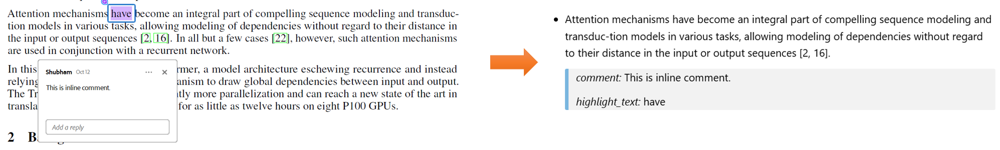
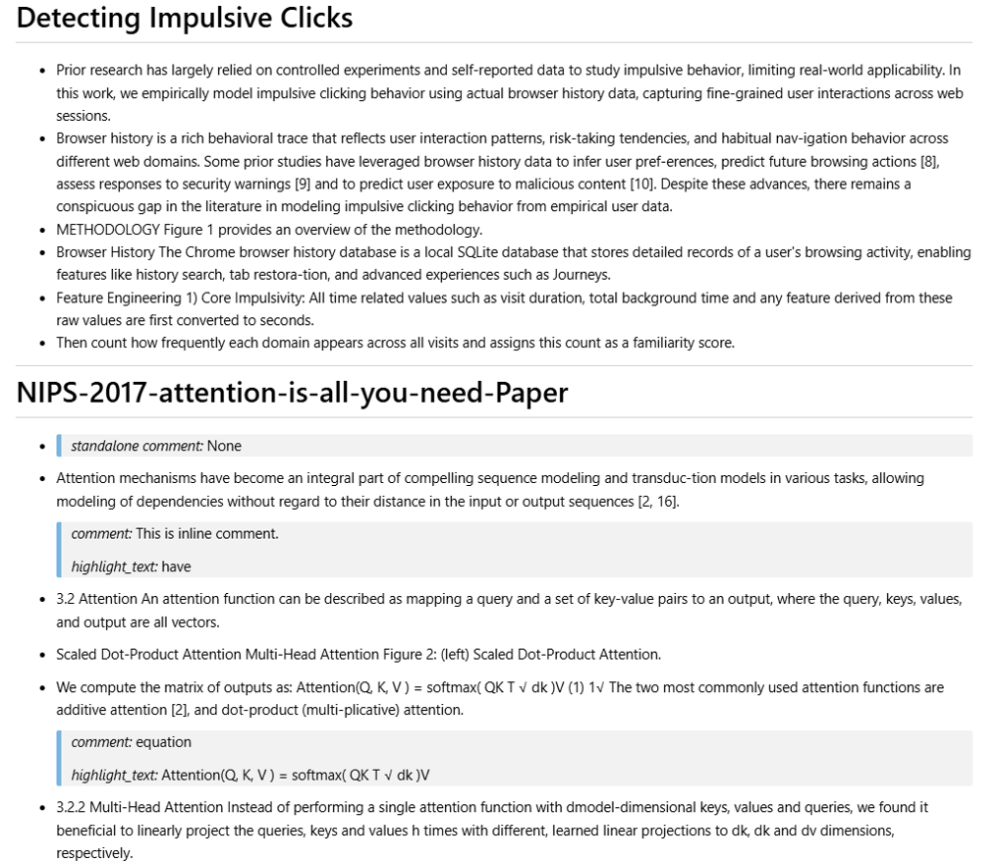
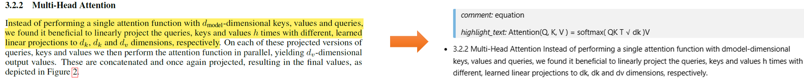

# 🧠🔍 Context-Sentence Aware PDF Annotation Export

## ⚠️ NOTE
This repository extends the functionality of [pdfannots](https://github.com/0xabu/pdfannots?tab=readme-ov-file) for a personal use case. You’re welcome to use it if it fits your needs. If you’re looking to customize or build on top of pdfannots for your own workflow, I hope this project serves as a helpful reference.

# Use Case
Researchers often annotate PDFs while reading papers and later want to revisit those notes without reopening each PDF and scrolling through the document again. This becomes tedious, and in practice many annotations are never reviewed. As a researcher myself, I wanted a way to automatically extract annotations from PDFs and store them elsewhere, making it easy to quickly revisit only the important parts I highlighted. This saves time and greatly improves the process of revisiting previously read papers.

While many annotation-extraction tools exist, they share one critical limitation: they export only the highlighted text. At first glance this seems sufficient, but it breaks down when only a fragment of a sentence is highlighted which a common reading practice. When tools export only that fragment, the meaning is often lost unless the PDF is opened again. For example, in following figure, only the word "have" is highlighted and annotated. Existing tools would export only the word "have", which is meaningless without its surrounding sentence. Readers benefit far more when the entire sentence—*the context sentence*—is included alongside the annotation. The right side of the figure shows the output generated by the solution in this repository.

This repository focuses on extracting:
- the full context sentence surrounding the annotation,
- the original highlighted text, and
- any associated comments.

Together, these provide a much clearer and more useful representation of your annotations outside the PDF.

# Installation
This project has been tested with pdfannots v0.5. Install it using: `pip install pdfannots==0.5`

# Extraction
This repository provides two modes of exporting annotations:

**1. Single-file export** – extracts annotations from one PDF into a separate Markdown file

**2. Consolidated export** – extracts annotations from all PDFs in a directory and combines them into a single Markdown file.

## 1. Single File Export
You can export annotations from a single PDF into a Markdown file using:

`python3 single_file_annotation.py --input_file path_to_pdf_file`

The generated .md file is saved in the same directory as the input PDF, sharing the same filename (but with a .md extension).

### Example Output:

## 2. Consolidated Export
To export annotations from all PDFs in a folder into one consolidated Markdown file, run:

`python3 multi_file_annotation.py --input_path path_to_Dir [--output_path path_to_store_consolidated_file]`

if `--output_path` is not provided, the consolidated file will be saved inside `input_path`.

### Example Output:

# Room for Improvement
To identify the context sentence, the solution first extracts the full page text and then splits it into sentences. Currently, sentence boundaries are detected using regular expressions. While this works reasonably well, it struggles with recognizing section headers, which sometimes get merged into the following sentence. In the example below, the extracted annotation incorrectly includes the section heading.

When working with plain text without styling metadata, reliably detecting section headers becomes difficult. A more robust approach would require considering attributes like font size, boldness, and layout structure. Even then, the solution is not foolproof. So far, the most accurate tool I’ve found for extracting document structure is [spacy-layout](https://github.com/explosion/spacy-layout). However, it requires downloading an OCR model and takes additional time to analyze the PDF. It provides near-accurate results, so if precision is more important than fast annotation extraction, it may be a good option to consider.
